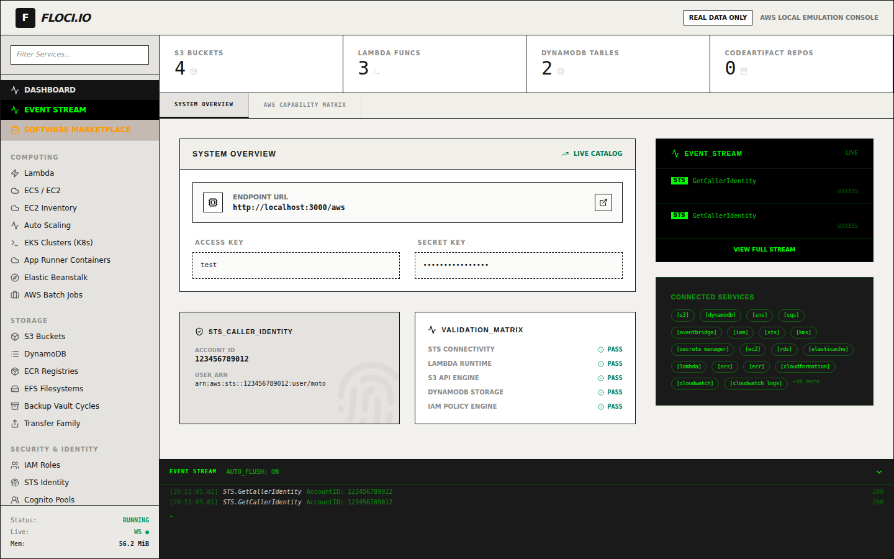
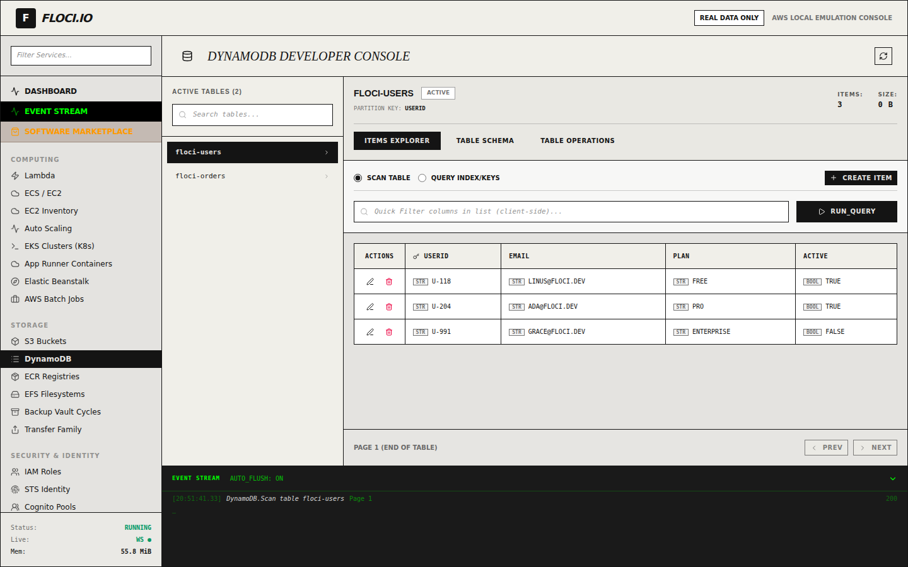
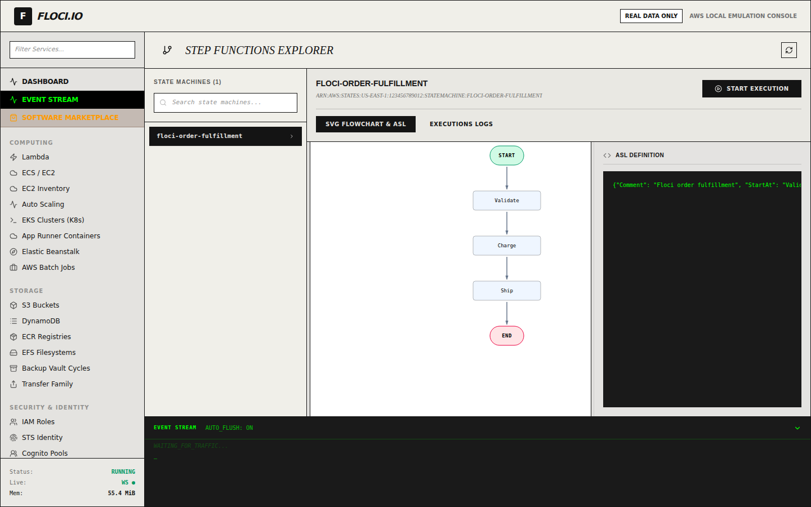
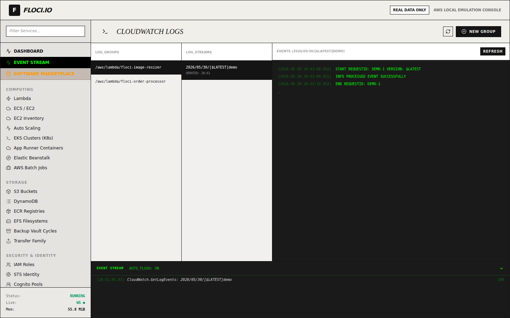
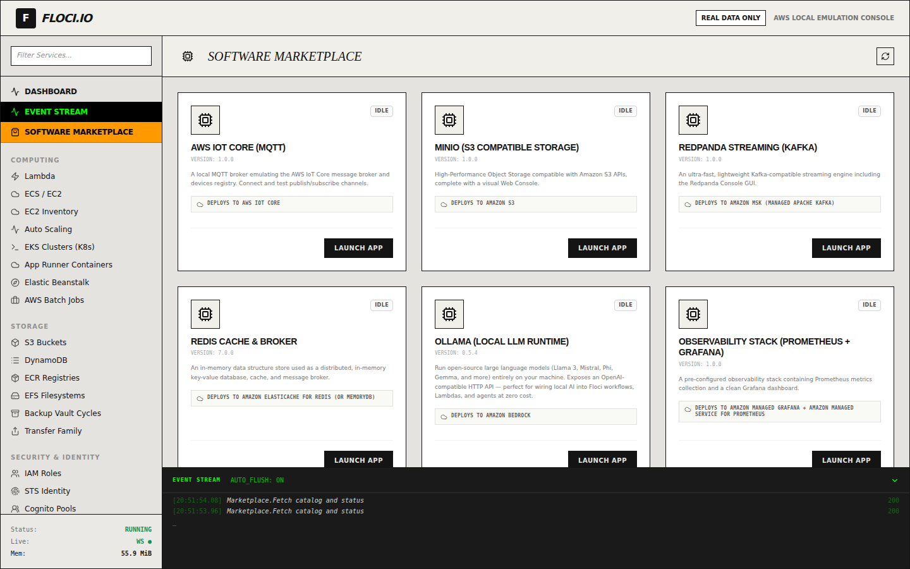

# Floci Studio — The Ultimate Local AWS Cockpit & Marketplace 🚀

Welcome to the ultimate cockpit of **Floci Studio**.

---

## 🎨 Ecosystem Architecture

The Floci Studio ecosystem is composed of several seamlessly coordinated architectural pieces to provide an agile and powerful experience:


* **Vite SPA (React + TypeScript):** Reactive tactical interface with dynamic loading (Lazy Loading) of 50+ AWS service views, optimized to offer ultra-fast rendering and a premium-retro aesthetic.
* **Backend API (FastAPI + Python):** Backend gateway running on port `8000` that interacts with the Docker Socket, orchestrates Marketplace recipes, routes compatibility calls, and persists state in JSON files on disk.
* **Native MCP Server (Python + `uv`):** Model Context Protocol server with 89 tools that natively communicates in-memory via `httpx.ASGITransport` with the backend. It enables Large Language Models (LLMs) to audit the AWS emulator state, provision local architectures, manage resource tags across all services, and deploy Marketplace recipes — all via natural language.
* **Engine (AWS Localstack / Floci Studio):** Local AWS emulator exposed on port `4566`.

---

## 🛍️ Local Marketplace: Modular Infrastructure

Floci Studio includes a catalog of parameterized local recipes in the `/recipes` folder. Each recipe automates the provisioning of local interconnected software using Docker Compose, allowing AI to:
1. **List** available recipes with their configurable environment variables.
2. **Deploy** and install local infrastructures on the fly.
3. **Monitor** Docker startup progress in real-time by reading log traces.
4. **Teardown** and clean up the environment when tasks are completed.

### Available Recipes

The catalog ships **25 recipes** out of the box — including a fully local AI stack (Ollama + Qdrant) and two AWS-SDK tools wired straight to the Floci emulator (DynamoDB Admin + S3 Admin):

- **AWS IoT Core (MQTT)**
- **AWS Transfer Family (SFTP)**
- **ClickHouse (Analytics OLAP DB)** — column-oriented database for real-time analytics 🆕
- **DynamoDB Admin** — web GUI for browsing and editing DynamoDB tables, pre-wired to Floci
- **HashiCorp Vault (Dev Mode)** — local secrets management, à la AWS Secrets Manager 🆕
- **Jaeger (Distributed Tracing)**
- **Keycloak + PostgreSQL**
- **Mailpit (SMTP)**
- **Meilisearch**
- **MinIO (S3 Compatible Storage)**
- **MongoDB + Mongo Express**
- **n8n Workflow Automation**
- **NATS JetStream**
- **Nginx Proxy Manager**
- **Observability (Grafana & Prometheus)**
- **Ollama (Local LLM Runtime)** — run Llama 3, Mistral & friends locally with an OpenAI-compatible API 🆕
- **PocketBase**
- **Portainer (Docker Cockpit)** — manage every container, image and volume from the browser 🆕
- **PostgreSQL Database**
- **Qdrant (Vector Database)** — embeddings & semantic search for local RAG pipelines 🆕
- **RabbitMQ Broker**
- **Redis Cache & Broker**
- **Redpanda (Kafka Compatible)**
- **S3 Admin** — web GUI to browse S3 buckets, pre-wired to Floci S3 on `4566` 🆕
- **Temporal Workflow Engine**

### 🔁 Local ↔ AWS Parity

Every recipe maps to a **managed AWS service**, so what you test locally behaves the same in production — the emulator's whole promise. Each recipe carries this mapping in its `recipe.json` (`aws` block), shows it as a **"Deploys to …"** badge on its Marketplace card, and documents it under **Path to AWS** in its README. The MCP server exposes the `aws` block too, so your AI agent can drive the migration.

| Recipe | Managed AWS service | Switch to production |
|---|---|---|
| PostgreSQL | Amazon RDS for PostgreSQL / Aurora | Repoint the connection string |
| Redis | Amazon ElastiCache for Redis | Point `REDIS_URL` at the cluster endpoint |
| MongoDB | Amazon DocumentDB | Repoint the connection string (+ RDS CA) |
| RabbitMQ | Amazon MQ for RabbitMQ | Swap the AMQP connection URI |
| NATS JetStream | Amazon SNS + SQS (or Amazon MQ) | Map subjects→SNS, consumers→SQS |
| Redpanda | Amazon MSK (Kafka) | Point bootstrap servers at MSK |
| MinIO | Amazon S3 | Drop the custom endpoint from the SDK |
| Meilisearch | Amazon OpenSearch Service | Migrate the index / self-host on ECS |
| Qdrant | OpenSearch Serverless (vector) / pgvector | Recreate the collection, repoint client |
| Keycloak | Amazon Cognito | Swap the OIDC issuer/JWKS URL |
| Vault | AWS Secrets Manager + KMS | Migrate secrets, swap the SDK |
| Mailpit | Amazon SES | Point SMTP at the SES relay |
| Ollama | Amazon Bedrock | Swap the base URL/SDK to Bedrock Runtime |
| ClickHouse | Self-host on ECS/EKS (alt: Redshift) | Run the image on ECS, attach a volume |
| Temporal | Self-host on EKS (alt: Step Functions) | Run on EKS with RDS persistence |
| n8n | Self-host on Amazon ECS/EKS | Run on ECS with EFS + RDS |
| Jaeger | AWS X-Ray (via ADOT) | Export OTLP to the ADOT collector |
| Observability | Managed Grafana + AMP | Remote-write to AMP, import dashboards |
| Nginx Proxy Manager | AWS ALB + ACM | Recreate hosts as ALB rules |
| PocketBase | Self-host on ECS/Fargate | Run on Fargate with an EFS volume |
| Portainer | Amazon ECS / EKS console | Push to ECR, define ECS/EKS workloads |
| IoT Core (MQTT) | AWS IoT Core | Repoint MQTT clients at the ATS endpoint |
| Transfer Family | AWS Transfer Family | Provision a Transfer Family SFTP server |
| DynamoDB Admin | Amazon DynamoDB | Repoint `DYNAMO_ENDPOINT` at the region |
| S3 Admin | Amazon S3 | Repoint `S3_ENDPOINT` at the region |

> **DynamoDB Admin** and **S3 Admin** go a step further — they're AWS-SDK clients wired straight to the Floci endpoint on `4566`, so you inspect the emulator's state locally exactly as you would the real AWS console.

---

## 🛠️ Floci Studio MCP Server Integration

The MCP server allows you to interact with your local AWS environment and local software Marketplace using natural language.

### Option A: Native Execution with `uv` (Recommended)
`uv` automatically manages the virtual environment and Python version transparently without complex global configurations on Windows:

```bash
# Sync virtual environment and dependencies
uv sync --project mcp

# Start the MCP server
uv run --project mcp python mcp/floci_mcp.py
```

### Option B: Dockerized Execution 🐳
If you prefer to completely isolate the server or don't have Python/uv on your host, you can run the MCP server directly as an interactive Docker container:

```bash
# Build the MCP server image
docker build -t floci-mcp mcp/

# Start the MCP server bound to standard input and output (stdio)
docker run -i --rm -e AWS_ENDPOINT_URL=http://host.docker.internal:4566 -e SIDECAR_TOKEN=open floci-mcp
```

### Configuration in Claude Desktop / Cursor
Add this block to your `claude_desktop_config.json` file to load it automatically:

```json
{
  "mcpServers": {
    "floci-mcp": {
      "command": "uv",
      "args": [
        "run",
        "--project",
        "./mcp",
        "python",
        "./mcp/floci_mcp.py"
      ],
      "env": {
        "SIDECAR_TOKEN": "open",
        "AWS_ENDPOINT_URL": "http://127.0.0.1:4566"
      }
    }
  }
}
```

---

## 🚀 From Floci Studio to Real Amazon AWS: How to Go to Production?

Once your application and its associated infrastructure are tested, validated, and working in your local Floci Studio cockpit, there are three recommended paths to automate deployment to Real AWS in production using automation "copilots":

### 1. AWS Copilot CLI (The Official AWS Copilot)
[AWS Copilot](https://aws.github.io/copilot-cli/) is the perfect tool to transpile containerized Docker recipes to real production environments:
* **How it works:** AWS Copilot analyzes your Dockerfile and dependencies and autonomously provisions all necessary infrastructure on **Amazon ECS (Elastic Container Service)** under AWS Fargate (serverless).
* **Path to production flow:**
  ```bash
  # Initialize the containerized application in AWS
  copilot init --app my-floci-app --name api-service --type "Load Balanced Web Service" --dockerfile ./Dockerfile
  
  # Deploy the environment to production
  copilot deploy --env prod
  ```
* **Advantages:** Automatically provisions the Load Balancer (ALB), private network VPC, IAM security roles, and SSL routing without the need to write manual CloudFormation templates.

### 2. Portable Infrastructure as Code (IaC) (Terraform / Pulumi / AWS CDK)
If your Floci Studio cockpit is interacting with resources like RDS databases, S3 buckets, or SQS queues, using IaC guarantees immediate portability:
* **How it works:** During local development, you configure your Terraform or AWS CDK provider to redirect API endpoint calls to the local Floci Studio address (`http://localhost:4566`).
* **Path to production flow:** Simply remove the endpoint rewrite lines from your configuration code so the Terraform SDK or CDK interacts directly with the real global APIs of Amazon Web Services:
  ```hcl
  # Local Development (pointing to Floci Studio)
  provider "aws" {
    region                      = "us-east-1"
    s3_use_path_style           = true
    skip_credentials_validation = true
    skip_metadata_api_check     = true
    endpoints {
      s3     = "http://localhost:4566"
      lambda = "http://localhost:4566"
      sqs    = "http://localhost:4566"
    }
  }

  # Real Production (Remove endpoints block to use real AWS)
  provider "aws" {
    region = "us-east-1"
  }
  ```

### 3. AWS SAM (Serverless Application Model)
If your application uses event-driven architectures with **AWS Lambda** functions and **API Gateway**:
* **How it works:** SAM allows you to test interconnected functions locally in Floci Studio and deploy them to real production in a single step.
* **Path to production flow:**
  ```bash
  # Validate local serverless template
  sam validate
  
  # Interactive and guided deployment to real AWS
  sam deploy --guided
  ```

---

## 🖥️ The GUI Cockpit

Floci Studio ships a full AWS-style console: 50+ service views, a live event
stream, the software marketplace, and an AWS capability matrix — all rendering
**real** data from your local emulator.



A few of the service views (every screenshot below is captured from a real,
passing end-to-end run — see [Testing](#-testing--the-gui-tour)):

| DynamoDB items explorer | Step Functions visualizer |
|---|---|
|  |  |
| **CloudWatch Logs drill-down** | **Software Marketplace** |
|  |  |

> Full visual tour in the docs: **[The GUI → The Cockpit](https://floci-studio.dev/gui/overview/)**
> and **[Service Views](https://floci-studio.dev/gui/service-views/)**.

---

## 🧪 Testing & the GUI Tour

The repo ships a reproducible **end-to-end harness** in [`e2e/`](e2e/) that boots
the whole stack, seeds a realistic dataset across ~18 AWS services, drives the
real React cockpit with Playwright, and captures the documentation screenshots
from the same run that asserts the data — so the docs can't drift from reality.

```bash
pnpm exec playwright install chromium   # once
e2e/run.sh up      # start emulator + sidecar + GUI, seed data
e2e/run.sh test    # run the Playwright GUI tour (captures screenshots)
e2e/run.sh down    # tear it all down
```

Unit / API tests run with Vitest, end-to-end specs with Playwright:

```bash
pnpm test          # Vitest unit + API tests
pnpm test:e2e      # Playwright specs (.playwright-mcp/)
```

When the real Floci engine image can't be pulled (CI, sandboxes), `e2e/run.sh`
transparently backs `:4566` with a `moto`-based, AWS-compatible stand-in that
speaks the same SDK/sigv4 protocol — no spec changes needed. Details in the docs:
**[End-to-End GUI Tests](https://floci-studio.dev/gui/testing/)**.

---

> [!TIP]
> **Development Excellence:** Floci Studio ensures that 100% of your code and infrastructure will run exactly the same in real AWS as on your development machine. Test locally at zero cost and deploy to production with total confidence!
