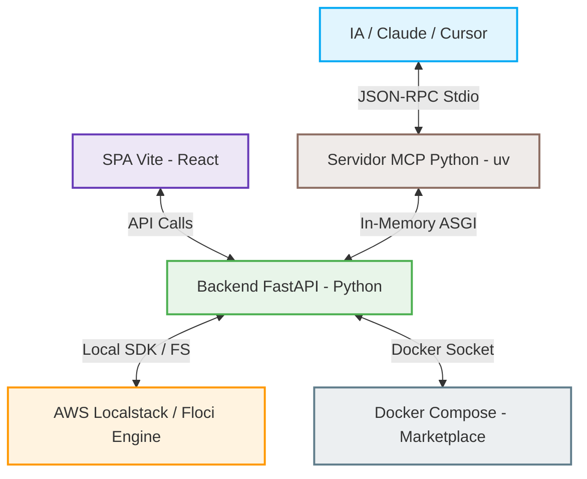

# Floci.io — The Ultimate Local AWS Cockpit & Marketplace 🚀

Bienvenido al cockpit definitivo de **Floci.io**. Este proyecto es un emulador visual e interactivo de servicios de AWS en local, diseñado para ofrecer una alternativa honesta, rápida y 100% real al desarrollo en la nube tradicional. Olvídate de los mocks simulados: Floci trabaja con datos reales, garantizando fidelidad absoluta frente al comportamiento real de AWS.

---

## 🎨 Arquitectura del Ecosistema

El ecosistema de Floci.io se compone de varias piezas arquitectónicas perfectamente coordinadas para brindar una experiencia ágil y potente:



* **Vite SPA (React + TypeScript):** Interfaz táctil reactiva con carga dinámica (Lazy Loading) de ~30 vistas de servicios de AWS, optimizada para ofrecer un renderizado ultra-rápido y una estética retro-premium.
* **Backend API (FastAPI + Python):** Pasarela de backend en el puerto `8000` que interactúa con el Docker Socket, orquesta las recetas del Marketplace y enruta llamadas de compatibilidad persistiendo el estado en disco JSON.
* **Servidor MCP Nativo (Python + `uv`):** Servidor del Model Context Protocol (v1.27.1+) que se comunica de forma nativa en memoria vía `httpx.ASGITransport` con el backend y permite a modelos de lenguaje (LLMs) auditar el estado del emulador AWS y aprovisionar arquitecturas locales.
* **Engine (AWS Localstack / Floci):** Emulador local de AWS expuesto en el puerto `4566`.

---

## 🛍️ local Marketplace: Infraestructura Modular

Floci.io incluye un catálogo de recetas locales parametrizadas en la carpeta `/recipes` (con soporte para **Redis, RabbitMQ, PostgreSQL y Keycloak**). Cada receta automatiza el aprovisionamiento de software local interconectado mediante Docker Compose, permitiendo a la IA:
1. **Listar** las recetas disponibles con sus variables de entorno configurables.
2. **Desplegar** e instalar las infraestructuras locales al vuelo.
3. **Monitorear** el progreso del levantamiento de Docker en tiempo real leyendo sus trazas de logs.
4. **Desmantelar** y limpiar el entorno cuando finalicen las tareas.

---

## 🛠️ Integración del Servidor MCP de Floci

El servidor MCP te permite interactuar en lenguaje natural con tu entorno local de AWS y tu Marketplace de software local.

### Opción A: Ejecución Nativa con `uv` (Recomendado)
`uv` autogestiona el entorno virtual y la versión de Python de forma transparente sin configuraciones globales complejas en Windows:

```bash
# Sincronizar entorno virtual y dependencias
uv sync --project mcp

# Arrancar el servidor MCP
uv run --project mcp python mcp/floci_mcp.py
```

### Opción B: Ejecución Dockerizada 🐳
Si prefieres aislar completamente el servidor o no tienes Python/uv en tu host, puedes ejecutar el servidor MCP directamente como un contenedor Docker interactivo:

```bash
# Construir la imagen del servidor MCP
docker build -t floci-mcp mcp/

# Arrancar el servidor MCP enlazado a la entrada y salida estandar (stdio)
docker run -i --rm -e AWS_ENDPOINT_URL=http://host.docker.internal:4566 -e SIDECAR_TOKEN=open floci-mcp
```

### Configuración en Claude Desktop / Cursor
Añade este bloque en tu archivo `claude_desktop_config.json` para cargarlo automáticamente:

```json
{
  "mcpServers": {
    "floci-mcp": {
      "command": "uv",
      "args": [
        "run",
        "--project",
        "c:/Users/Pelayo/Proyectos/floci-gui/floci-gui-main/mcp",
        "python",
        "c:/Users/Pelayo/Proyectos/floci-gui/floci-gui-main/mcp/floci_mcp.py"
      ],
      "env": {
        "SIDECAR_TOKEN": "open",
        "AWS_ENDPOINT_URL": "http://127.0.0.1:4566"
      }
    }
  }
}
```

---

## 🚀 De Floci a Amazon AWS Real: ¿Cómo pasar a Producción?

Una vez que tu aplicación y su infraestructura asociada estén probadas, validadas y funcionando en tu cockpit local de Floci.io, existen tres caminos recomendados para realizar el despliegue automático hacia AWS Real en producción utilizando "copilots" de automatización:

### 1. AWS Copilot CLI (El Copiloto Oficial de AWS)
[AWS Copilot](https://aws.github.io/copilot-cli/) es la herramienta perfecta para transpilar recetas contenerizadas en Docker a entornos reales de producción:
* **Cómo funciona:** AWS Copilot analiza tu Dockerfile y tus dependencias y aprovisiona de manera autónoma toda la infraestructura necesaria en **Amazon ECS (Elastic Container Service)** bajo AWS Fargate (serverless).
* **Flujo de paso a producción:**
  ```bash
  # Inicializar la aplicacion contenerizada en AWS
  copilot init --app mi-app-floci --name api-service --type "Load Balanced Web Service" --dockerfile ./Dockerfile
  
  # Desplegar el entorno a produccion
  copilot deploy --env prod
  ```
* **Ventajas:** Aprovisiona el balanceador de carga (ALB), VPC de red privada, roles de seguridad de IAM y enrutamiento SSL de forma automatizada y sin necesidad de escribir plantillas manuales de CloudFormation.

### 2. Infraestructura como Código (IaC) Portable (Terraform / Pulumi / AWS CDK)
Si tu cockpit de Floci está interactuando con recursos como bases de datos RDS, buckets S3 o colas SQS, el uso de IaC garantiza una portabilidad inmediata:
* **Cómo funciona:** Durante el desarrollo local, configuras tu proveedor de Terraform o AWS CDK para que redirija los endpoints de llamadas a la dirección local de Floci (`http://localhost:4566`).
* **Flujo de paso a producción:** Simplemente retiras las líneas de reescritura de endpoints de tu código de configuración para que el SDK de Terraform o CDK interactúe directamente con las APIs globales reales de Amazon Web Services:
  ```hcl
  # Desarrollo Local (apuntando a Floci)
  provider "aws" {
    region                      = "us-east-1"
    s3_use_path_style           = true
    skip_credentials_validation = true
    skip_metadata_api_check     = true
    endpoints {
      s3     = "http://localhost:4566"
      lambda = "http://localhost:4566"
      sqs    = "http://localhost:4566"
    }
  }

  # Produccion Real (Eliminar bloque endpoints para usar AWS real)
  provider "aws" {
    region = "us-east-1"
  }
  ```

### 3. AWS SAM (Serverless Application Model)
Si tu aplicación utiliza arquitecturas orientadas a eventos con funciones **AWS Lambda** y **API Gateway**:
* **Cómo funciona:** SAM permite probar funciones en local interconectadas a Floci y desplegarlas a producción real en un solo paso.
* **Flujo de paso a producción:**
  ```bash
  # Validar plantilla serverless local
  sam validate
  
  # Despliegue interactivo y guiado hacia AWS real
  sam deploy --guided
  ```

---

> [!TIP]
> **Excelencia de Desarrollo:** Floci.io te asegura que el 100% de tu código e infraestructura correrán exactamente igual en AWS real que en tu máquina de desarrollo. ¡Prueba en local a coste cero y despliega a producción con total confianza!
