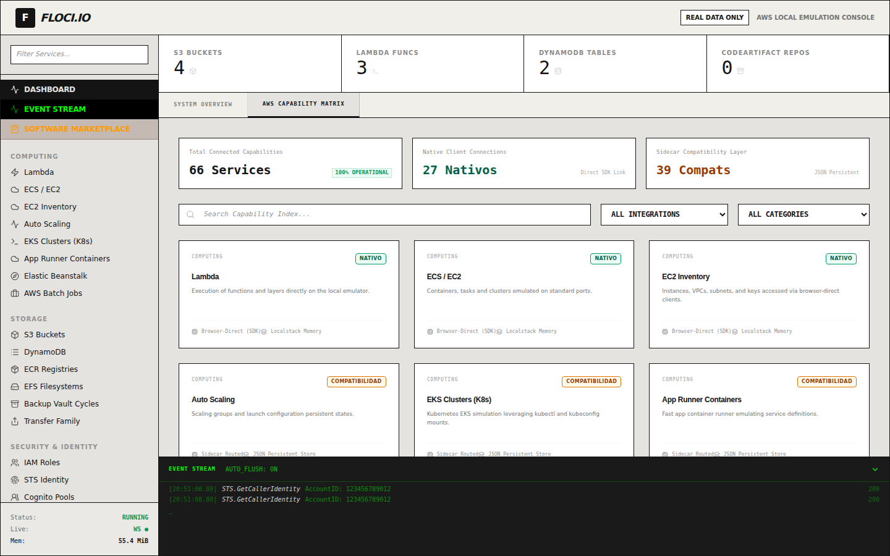
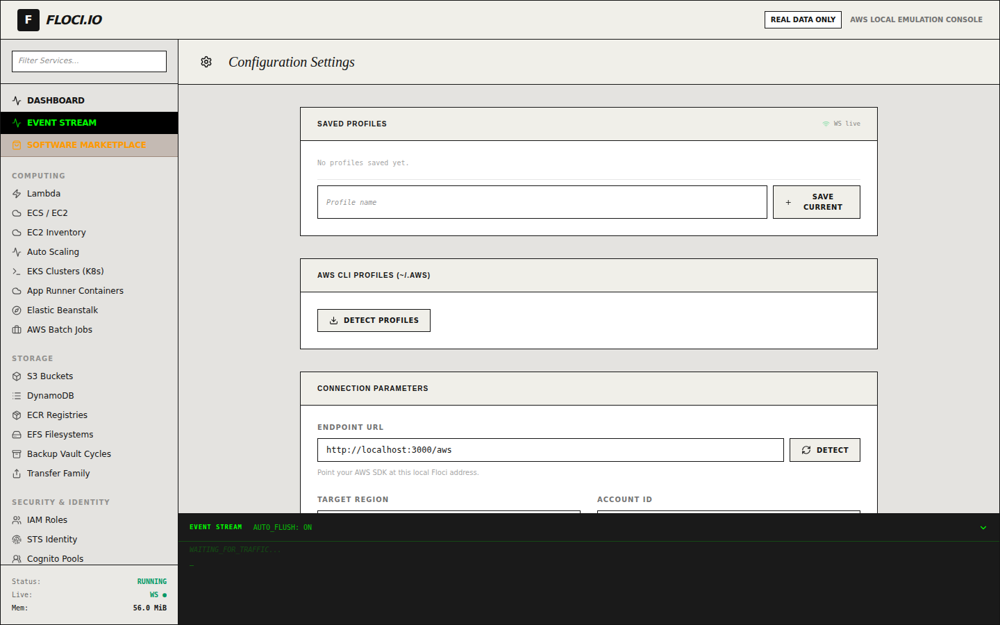

The **Floci Studio cockpit** is a React single-page app that gives you a full
AWS-style console for your local emulator — ~50 service views, a live event
stream, a one-click software marketplace, and an AWS capability matrix. It talks
to the Floci engine (`:4566`) for browser-direct SDK calls and to the FastAPI
sidecar (`:8000`) for everything that needs a server.

:::note[Every screenshot here is real]
The images on these pages are **not mock-ups**. They are produced by an
automated Playwright tour (`.playwright-mcp/gui-tour.spec.ts`) that drives the
live GUI against a fully-seeded emulator and asserts the data is present before
each capture. See [How these screenshots are made](/gui/testing/).
:::

## The dashboard

The landing screen is mission control. The header carries the **REAL DATA ONLY**
policy badge, the top strip shows live resource counts (S3 buckets, Lambda
functions, DynamoDB tables, CodeArtifact repos), and the right rail streams every
AWS call the UI makes — colour-coded by service and status.

The left sidebar groups every emulated service (Computing, Storage, Security &
Identity, Networking, …). The footer shows process status, the live WebSocket
indicator, and the in-browser memory footprint.

## AWS capability matrix

Switch to the **AWS Capability Matrix** tab to see, at a glance, every service
the cockpit can reach — which ones are **native** (browser-direct AWS SDK against
the emulator) versus **compatibility** (routed through the sidecar's persistent
JSON store).

## Software marketplace

The marketplace turns Docker Compose recipes into one-click local
infrastructure. Each card shows the recipe, its version, and a **"Deploys to …"**
badge mapping it to the managed AWS service it stands in for — so what you test
locally has a clear path to production.

## Settings & connection profiles

The settings view manages the emulator endpoint, region, and credentials, and
lets you save named connection profiles.

## Where next

- [Service views — a visual tour](/gui/service-views/) — S3, DynamoDB, Lambda,
  KMS, CloudWatch and more, each rendering real seeded data.
- [How these screenshots are made](/gui/testing/) — the reproducible end-to-end
  harness behind every image on this site.
