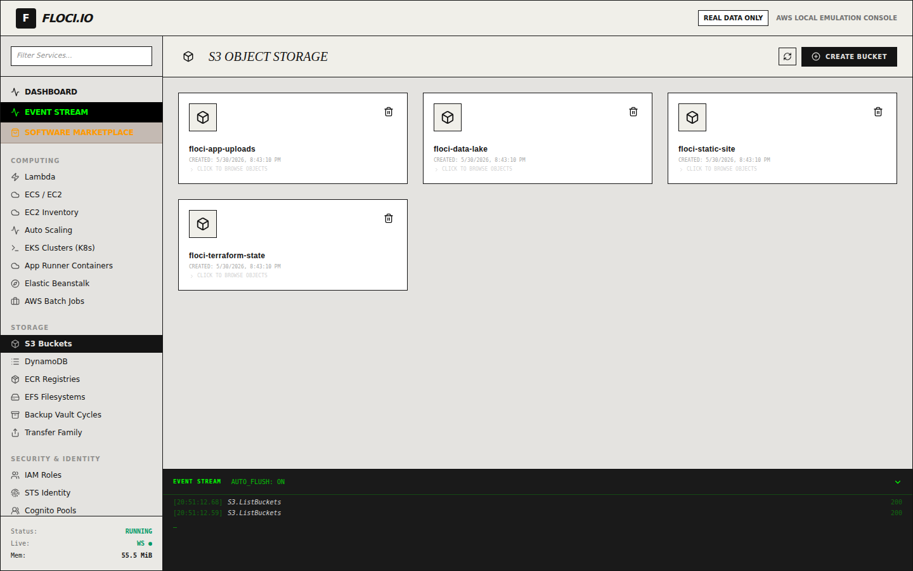
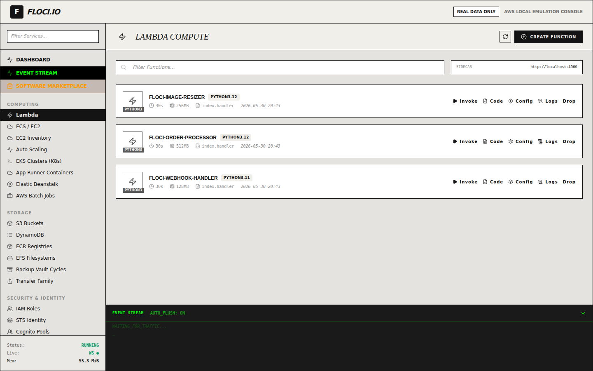
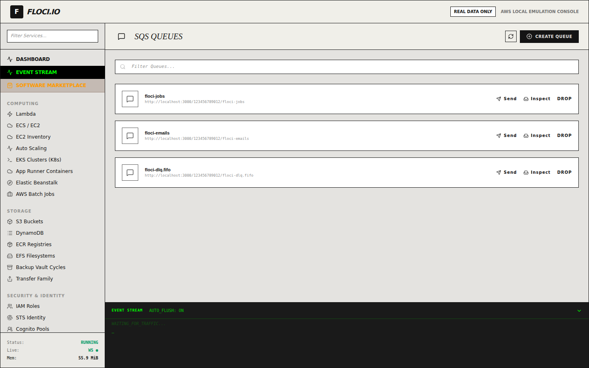
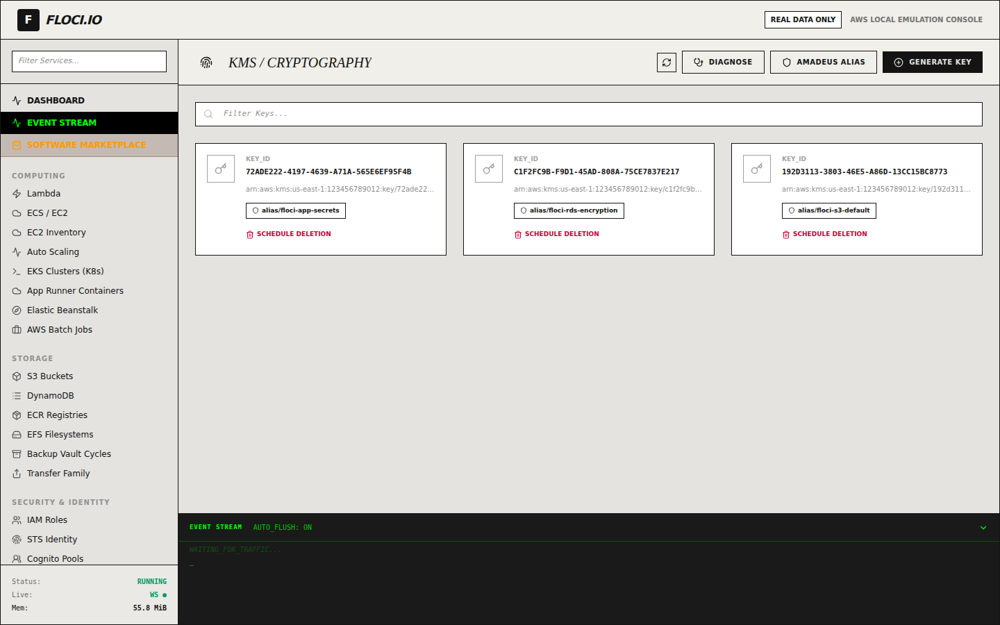
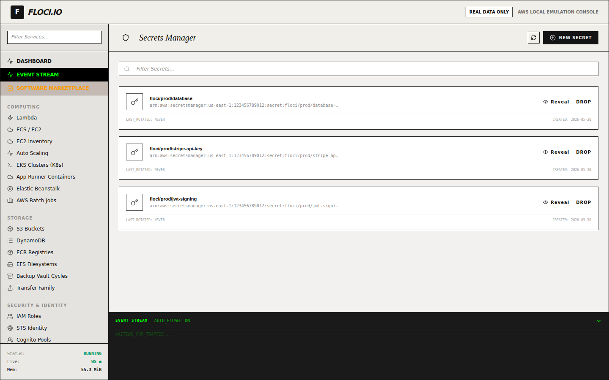
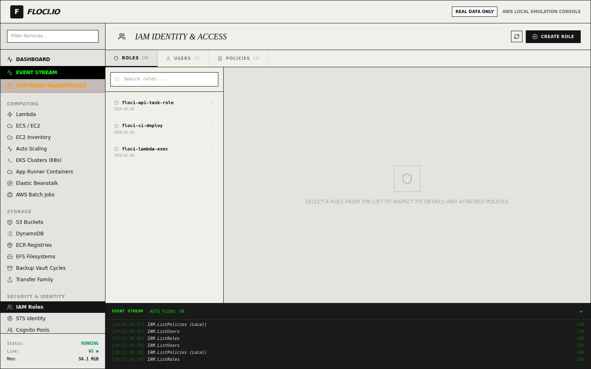
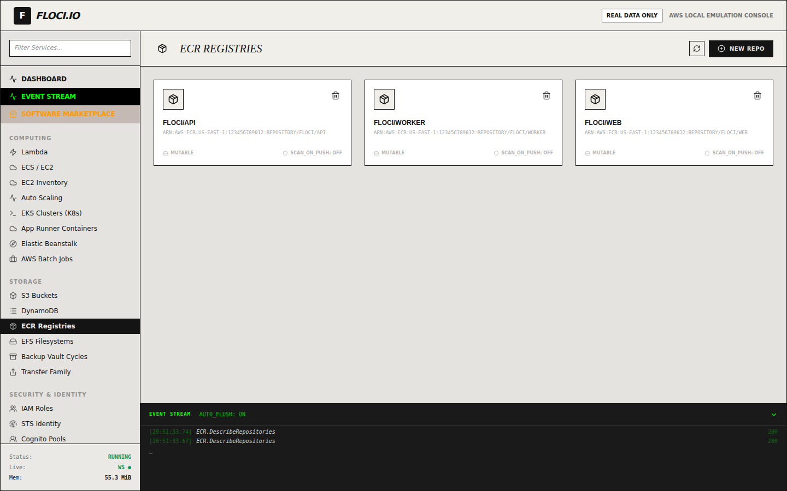
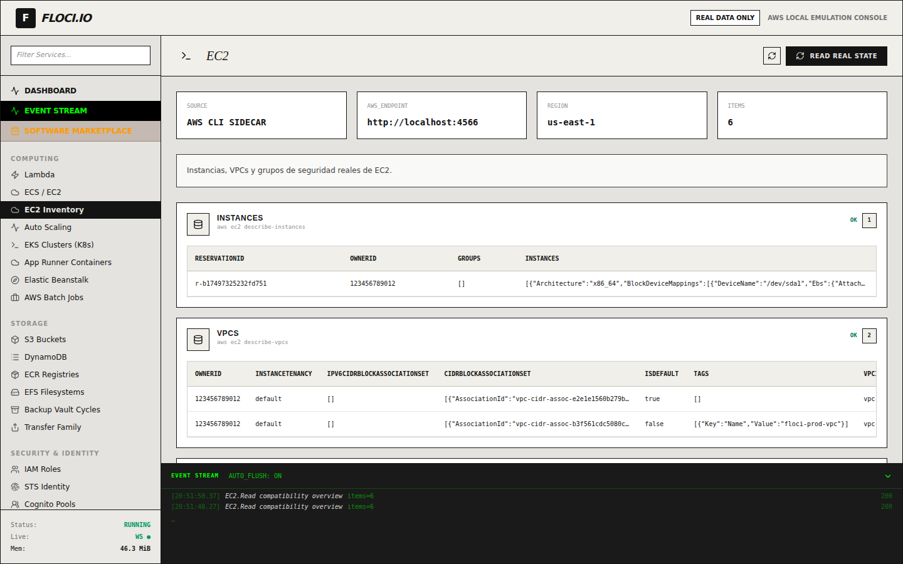

Each AWS service the cockpit supports has a purpose-built view. The screenshots
below come straight from the [end-to-end GUI tour](/gui/testing/): the harness
seeds a realistic dataset into the emulator, opens each view, asserts the seeded
resources are visible, and captures the screen.

The dataset is deterministic — 4 S3 buckets, 2 DynamoDB tables, 3 Lambda
functions, 3 KMS keys, 3 secrets, and so on — so these views are exactly what
you'd see after running `e2e/seed.py` against your own stack.

## S3 — Object storage

Browse buckets and drill into objects. Here: four seeded buckets
(`floci-app-uploads`, `floci-data-lake`, `floci-static-site`,
`floci-terraform-state`), with a live `S3.ListBuckets 200` in the event stream.

## DynamoDB — Tables & items

A developer console with an items explorer, table schema, and operations tabs.
Selecting `floci-users` scans the table and renders the typed rows
(string, boolean) with inline edit/delete actions.

## Lambda — Compute

Lists functions with runtime, memory, timeout and handler, plus invoke / code /
config / logs actions per function.

## SQS — Queues & messages

Standard and FIFO queues with their depths and message controls.

## SNS — Topics & subscriptions

Pub/sub topics with their subscriptions.

## KMS — Cryptography

Customer-managed keys with their aliases, plus diagnose and key-generation
controls.

## Secrets Manager

Secrets with their full ARNs, reveal and rotate/drop actions.

## IAM — Identity & access

Roles, users and policies with their trust relationships.

## CloudWatch Logs

A three-pane drill-down: log groups → streams → events. Here, the
`/aws/lambda/floci-image-resizer` group is opened down to its `START / INFO /
END` log lines.

## ECR — Container registries

Image repositories for your services.

## Step Functions

State machines rendered as an SVG flowchart alongside their Amazon States
Language definition.

## EC2 — Inventory (via the sidecar)

Some views read through the sidecar's AWS-CLI connector rather than the browser
SDK. The EC2 inventory shows the source (**AWS CLI SIDECAR**), the endpoint, and
the real `describe-instances` / `describe-vpcs` output — including the seeded
`floci-prod-vpc`.

